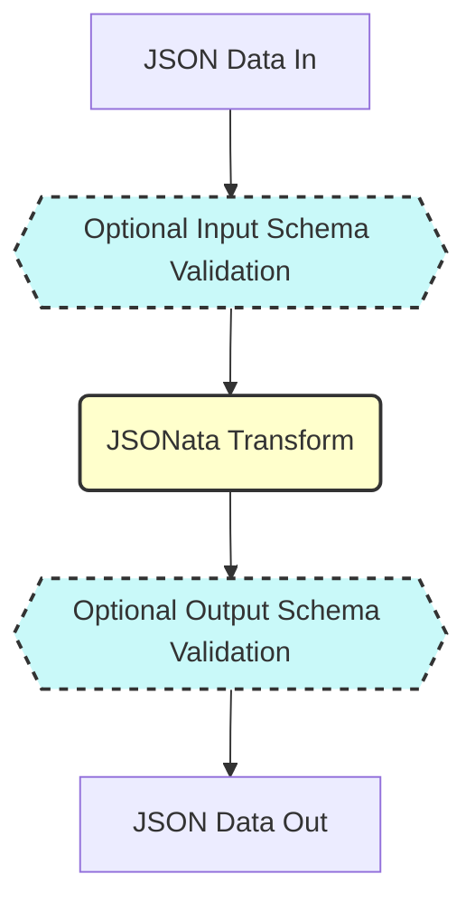

# jdxd ⚡️⭐️🔀✨: json data to data

a small program to facilitate codified data-to-data transformation in json-space.

in basic usage, it expects to receive a json/jsonnet/jsonl file or input stream, a jsonata transformer, and outputs the transformed result to stdout

you can optionally provide input and output json(net) schemas to be used for pre/post validation
